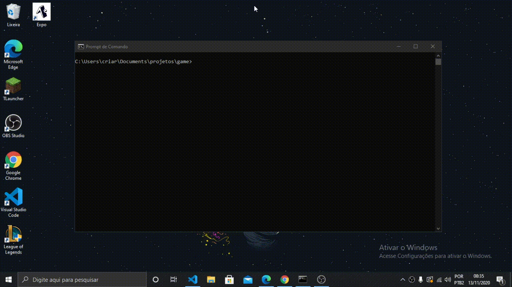

<h1 align="center">My first game 🎮</h1>
<p align="center">My first game using web tecnologies</p>



# Table of contents
<!--ts-->
  * [About](#about-)
  * [Prerequisites](#prerequisites)
  * [How to run the game](#how-to-run-the-game)
  * [Tecnologies](#tecnologies-)
  * [Author](#author)
<!--te-->

# About 📜
I've been making this project just for fun and, despite it's a pretty simple game, I ended up learning some cool things which I want to teach someday, probably writing articles about the progress of this project.

# Prerequisites
Before start the game, you're gonna need to have [Node.js](https://nodejs.org/en/) installed on your machine.

# How to run the game
If you already have [Node.js](https://nodejs.org/en/) installed on your machine, just open the terminal in the game's folder and follow the steps bellow:

1. Install the dependencies:
```bash
> npm install
```

2. Start the game:
```bash
> npm run start
```

# Tecnologies 🛠
- [Electron](https://www.electronjs.org/)

# Author

<a href="https://github.com/DanielGustavo">
  
</a>

<p>Made by <a href="https://github.com/DanielGustavo"><b>Daniel Gustavo</b></a></p>

[](mailto:danielgustavo5205@gmail.com)
